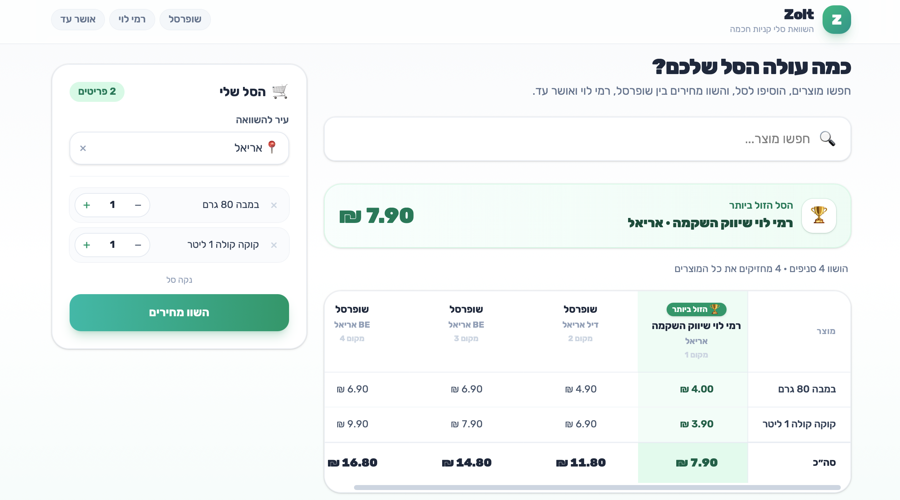
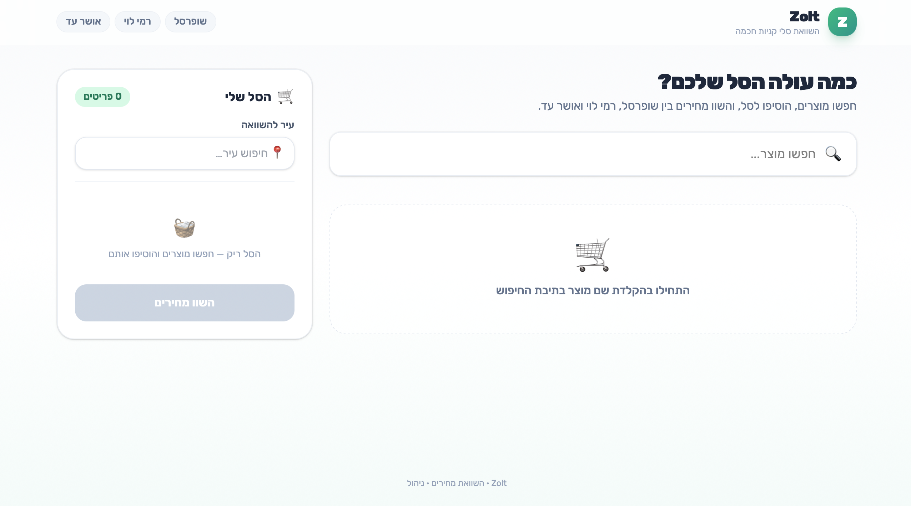
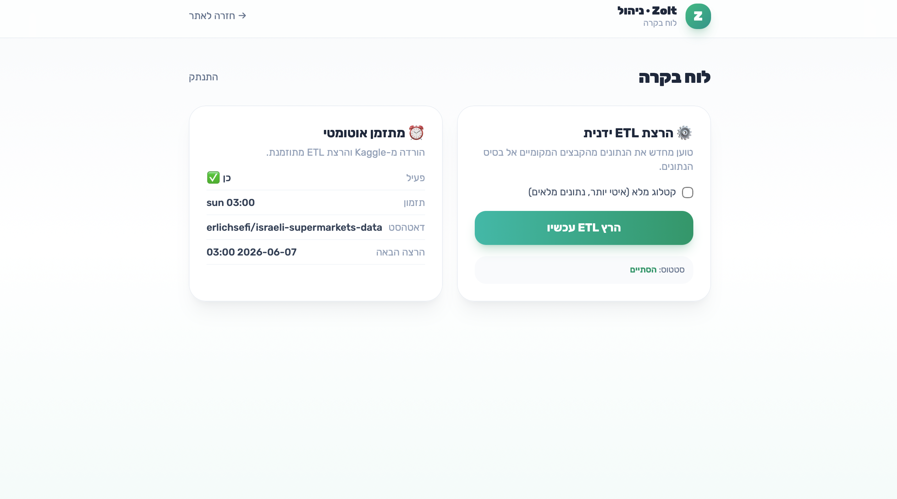
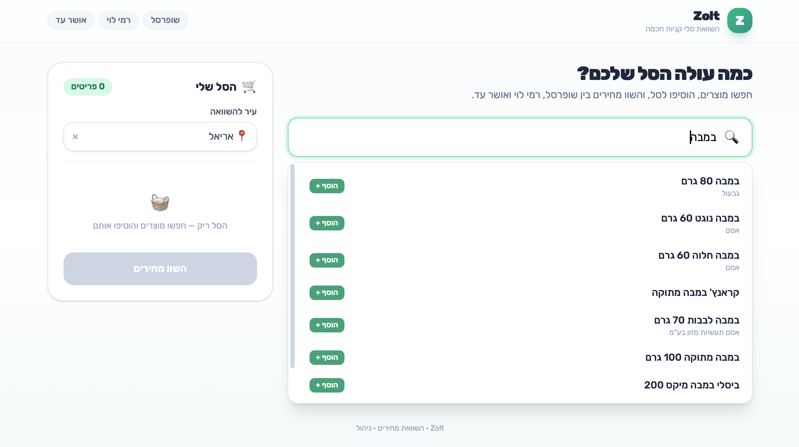

<div align="center">

# 🛒 Zolt

### Find the cheapest place to buy your grocery basket — across every branch of Israel's major supermarket chains.

**שופרסל · רמי לוי · אושר עד**

[](https://fastapi.tiangolo.com/)
[](https://www.python.org/)
[](https://react.dev/)
[](https://vitejs.dev/)
[](https://tailwindcss.com/)
[](https://www.mysql.com/)
[](#-testing)
[](#-testing)

A modern, full-stack, **RTL** web platform that compares a live shopping basket across
**540+ branches** and **2.4M+ price points** sourced from the Israeli price-transparency feed.

</div>

---

## 📸 Screenshots
| Home & Search | Comparison Table |
|:---:|:---:|
|  |  |
| **Autocomplete Search** | **Admin Panel** |
|  |  |

---

## ✨ What it does

1. **Search** any product (Hebrew, with autocomplete) and build a basket.
2. **Pick a city** from a searchable combobox.
3. **Compare** — Zolt computes `Σ(price × quantity)` for every relevant branch of the three
   chains in that city, ranks them cheapest-first, highlights the **winner**, and clearly marks
   branches that are **missing items**.

---

## 🧠 Engineering deep-dives

### 1. An ETL that streams **millions of rows in ~90 MB of RAM**
The original loader used **pandas** and peaked at **337 MB** RSS. We rewrote the reader around the
**stdlib `csv` module** — pure streaming, no DataFrames — which:
- dropped peak memory **337 MB → 90 MB** (under a strict 100 MB budget) while loading **~3.4M
  upserts / 4.3M rows**,
- forward-fills the *grouped* feed format (chain/store identity columns appear only on each
  store-block's header row) row-by-row, carrying state across chunk boundaries,
- skips malformed lines gracefully and batch-**upserts in groups of 1,000** via
  `INSERT … ON DUPLICATE KEY UPDATE` (idempotent re-runs).

```text
osher_ad --full · 85 MB file · 385,333 prices · peak RSS 90 MB · 24 s
```

### 2. Fuzzy, name-based price matching
Chains use **different barcodes/PLUs and different wordings** for the same item, so strict
barcode/exact-name matching dropped competing chains. The comparison engine instead:
- extracts the **first 2–3 prominent words** of each basket item (skipping sizes, units &
  stop-words: `קוקה קולה שישיה 1.5 ליטר → [קוקה, קולה]`),
- matches overlapping products with MySQL **`MATCH() AGAINST()`** (boolean, prefix) on a
  `FULLTEXT` index, with a `LIKE` fallback,
- picks the **cheapest matching product per store** to represent each item — so a competing chain
  can finally appear *and win*.

### 3. Cross-chain city normalization
Shufersal ships city **names** (with variants), while Rami Levy & Osher Ad ship numeric **CBS
locality codes** (`5000 → תל אביב`). [`etl/cities.py`](etl/cities.py) maps codes → names, unifies
spelling/spacing/dash variants, and falls back to deriving the city from the store name — so all
three chains share one canonical city and the per-city comparison actually works.

### 4. The WebKit RTL **sticky-scroll** fix
Wide RTL tables glitched on Safari/WebKit when dragging the horizontal scrollbar. The fix pins the
product column on each `<th>/<td>` (solid background, `z-20/30`) and forces each pinned cell onto
its **own GPU layer** with `transform: translateZ(0)` (`transform-gpu` + `will-change-transform`)
— so the column never drops during scroll.

### 5. Smart **10-branch cap**
Big cities returned 30+ branches. Results are capped to the 10 most relevant — the **cheapest
branch of each chain first** (guaranteeing a mix), then the next-cheapest — with the overall winner
always kept and ranked first.

---

## 🏗️ Architecture

A classic **3-tier monolith**:

```
┌──────────────────────┐     HTTP/JSON     ┌──────────────────────┐     SQL      ┌──────────────┐
│   Frontend (React)   │  ───────────────▶ │   Backend (FastAPI)  │ ──────────▶  │   MySQL 8.0  │
│  Vite · Tailwind RTL │  ◀─────────────── │  pooled SQLAlchemy   │ ◀──────────  │ stores/      │
└──────────────────────┘                   └──────────┬───────────┘              │ products/    │
                                                      │                          │ prices       │
                                       APScheduler ▲  │  BackgroundTasks         └──────▲───────┘
                                       (Sun 03:00)  │  ▼ manual trigger                 │
                                              ┌──────┴───────────┐    upsert (1k batches)│
                                              │  ETL (csv stream)│ ──────────────────────┘
                                              │  Kaggle download │
                                              └──────────────────┘
```

| Tier | Technology |
|------|------------|
| **Frontend** | React 18 · Vite 5 · Tailwind CSS v4 · full RTL (`dir="rtl"`, Rubik) |
| **Backend** | Python · FastAPI · SQLAlchemy (QueuePool) · PyMySQL · PyJWT · bcrypt · APScheduler |
| **Database** | MySQL 8.0 (`utf8mb4`, `FULLTEXT`, unique upsert key) |
| **ETL** | stdlib `csv` streaming · Kaggle API · batch upserts |

---

## ⚡ Getting started

> **Prerequisites:** Docker Desktop · Node ≥ 18 · Python ≥ 3.11

### Fast path (Makefile)

```bash
cp .env.example .env      # adjust secrets if you like
make setup                # venv + Python deps + npm install
make run                  # MySQL (Docker) + FastAPI + Vite, together
make etl-full             # one-time: load the full catalog into MySQL
```

- **App:** http://localhost:5173 · **API docs:** http://127.0.0.1:8000/docs · **Admin:** http://localhost:5173/admin
- Dev admin login: `admin` / `Zolt!Admin2026`

### Manual path

```bash
# 1) Database
docker compose up -d

# 2) Backend
python3 -m venv .venv && source .venv/bin/activate
pip install -r backend/requirements.txt
uvicorn backend.app.main:app --reload        # http://127.0.0.1:8000

# 3) Load data (once)
pip install -r etl/requirements.txt
python -m etl.run --full                      # or `python -m etl.run` for the lighter snapshot

# 4) Frontend
cd frontend && npm install && npm run dev     # http://localhost:5173
```

---

## 🔌 API

| Method & path | Description |
|---------------|-------------|
| `GET /products/search?q=&limit=` | Product search / autocomplete (FULLTEXT + LIKE fallback) |
| `GET /stores?city=&chain=` | List branches, filterable by city / chain |
| `GET /stores/cities` | Distinct cities (for the combobox) |
| `POST /basket/compare` | Compare a basket → ranked branches, winner, missing items |
| `POST /admin/login` | Admin login (bcrypt) → JWT (1h) |
| `POST /admin/etl/run` | 🔒 Trigger the ETL in the background (BackgroundTasks) |
| `GET /admin/etl/status` · `GET /admin/scheduler` | 🔒 ETL / scheduler state |
| `GET /health` | Liveness + DB connectivity |

---

## 🗄️ Database schema

- **`stores`** — one row per branch. Natural key `(chain_id, sub_chain_id, store_code)`; indexed by `city`.
- **`products`** — keyed by barcode: `UNIQUE(barcode)` + `FULLTEXT(name)` (search & fuzzy match).
- **`prices`** — FKs to products & stores, with the **critical** `UNIQUE(product_id, store_id)` that
  powers the ETL's idempotent upserts.

Loaded dataset (full catalog): **~2.39M prices · ~50K products · 540 branches** —
Shufersal 71% · Rami Levy 24% · Osher Ad 5%.

---

## 🧪 Testing

```bash
make test                          # 32 backend unit tests
python -m scripts.run_test_plan    # the 10 documented Test-Plan cases (TC-1..TC-10)
```

- **32** unit tests (comparison ranking, fuzzy tokenization, city normalization).
- **10/10** Test-Plan cases — incl. negative-quantity rejection (`400`), upsert-without-duplicate,
  malformed-row skipping, graceful no-stores response, JWT auth, and the **<100 MB ETL** budget.

---

## 📁 Project structure

```
Zolt/
├── docker-compose.yml          # MySQL 8.0
├── Makefile                    # setup / run / stop / etl / test
├── db/init/01_schema.sql       # stores · products · prices
├── backend/app/                # FastAPI: routers, services, security, scheduler
├── etl/                        # csv-streaming ETL, city normalization, Kaggle downloader
├── frontend/src/               # React app: SearchBar, BasketSidebar, ComparisonTable, Admin
├── scripts/                    # debug + Test-Plan runner
├── docs/screenshots/           # README images
├── secrets/                    # kaggle.json (git-ignored)
└── archive/                    # local Kaggle dataset (git-ignored)
```

---

<div align="center">

Built with care — from a memory-tuned ETL to a Stripe/Vercel-grade RTL UI. 🛒💚

</div>
